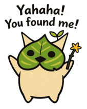

  <source media="(prefers-color-scheme: dark)" srcset="https://raw.githubusercontent.com/fengbanjiazhu/profile-assets/main/profile/github-contribution-grid-snake-dark.svg">
  <source media="(prefers-color-scheme: light)" srcset="https://raw.githubusercontent.com/fengbanjiazhu/profile-assets/main/profile/github-contribution-grid-snake.svg">
  

<table align="center" border="1">
  <tr>
    <td>
      
    </td>
    <td>
      <b>🥳 Yahaha! You found me!</b>
        
      📍 Sydney based Full Stack Developer | Game Developer
        
      🌐 Learn more about me through my <a href="https://feixiang.com.au">page</a>
    </td>
  </tr>
</table>

  
  
  

